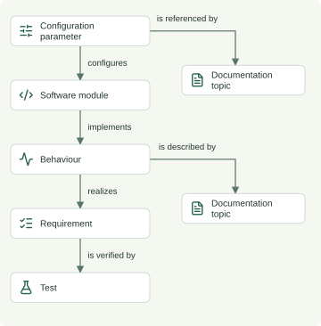

# Impact Analyzer

I built a tool that turns a proposed engineering change into an explainable
review plan. It models a fictional industrial coffee machine system, connecting
configuration parameters and behaviours to engineering artifacts and documentation topics.

The brew-temperature example shows the workflow:

- **Change:** raise the target from 93°C to 95°C.
- **Review:** see four engineering artifacts and two documentation topics.
- **Explain:** inspect the relationship path behind every candidate.

The diagram shows the review paths. Labels describe traversal;
stored relationships can point in the opposite direction.

## The problem

**If something changes, what artifacts might be affected?**

Requirements, software modules, tests, and documentation each hold part of the
product’s design knowledge.
Engineers and technical writers need specific review targets, and reasons
for selecting them. A parameter reference reveals a direct connection.
Other artifacts may describe or verify the related behaviour.

## Modelling the connections

Three decisions keep the model small and the results inspectable:

- **Explicit relationships:** 15 synthetic entities cover parameters,
  software, behaviours, requirements, tests, and documentation topics.
  Each connection has a defined meaning, such as `configures` or `verifies`.
- **Specific documentation targets:** individual topics connect to parameters
  through `references` and to behaviours through `describes`.
- **Bounded review policy:** the analyzer follows only approved relationships
  and directions. A shared connection alone does not justify inclusion.

The review policy controls how the analyzer follows stored relationships. It
follows **behaviour → implementedBy → module** backwards from the module.
The interface displays that step as **module → implements → behaviour**.

A separate steam-temperature branch checks the policy's boundaries.
Its parameter and documentation topic stay outside the brew result.

## From proposed change to review plan

The browser workflow has three steps:

1. Choose a type of change, select an item, and enter a value or description.
2. Review the engineering and documentation groups.
3. Expand **Show connection path** to inspect the explanation.

The brew-temperature example returns six candidates:

| Review group | Candidate | Why it appears |
| --- | --- | --- |
| Engineering | Temperature controller | Uses the parameter as its target |
| Engineering | Brew temperature regulation | The controller implements this behaviour |
| Engineering | Brew temperature tracking requirement | The behaviour realizes this requirement |
| Engineering | Brew temperature tracking test | Verifies the requirement |
| Documentation | Set brew temperature | References the parameter |
| Documentation | Brew regulation specification | Describes the behaviour |

The tracking test has this complete explanation:

> Brew target temperature → configures → Temperature controller
> → implements → Brew temperature regulation → realizes → Brew temperature
> tracking → is verified by → Brew temperature tracking test

Each explanation includes the stored edges and traversal directions.
The engine uses breadth-first traversal and records visited entities.
It returns one deterministic shortest path per candidate.
Paths stop at tests and documentation topics.

## Behaviour changes and review findings

The [behaviour scenario](third-working-scenario.md) changes brew readiness from
reaching the configured temperature to staying within ±1°C for five continuous
seconds. Starting at the behaviour returns its implementing module, requirement,
verifying test, and documentation topic. Modules terminate traversal for behaviour
changes to avoid expanding through shared implementations into unrelated behaviours.

The browser shows current/proposed descriptions with an optional word-level diff
using separate Current and Proposed sentences with subtle highlights.
Lucide icons distinguish artifact types in cards and visual connection paths.
Review questions and traversal rules agree across the browser and Python reference
engine. The browser derives scenario suggestions directly from the JSON model;
the optional local server also exposes them through `/api/scenarios`.

Each candidate defaults to Needs change as a demo starting state, not a proven
engineering conclusion. Three direct icon buttons select Needs change, Needs
investigation, or No change needed. Selecting investigation opens the note editor.
Completed no-change cards become grey and compact. Status counts double as filters;
filtering changes card visibility without excluding artifacts from the report.

A visible Markdown report updates as statuses and notes change. It contains the
proposal, analysis timestamp, status summary, findings, and connection paths.
The report groups No change needed items into concise lines with their notes. A copy icon
makes the report available for a change ticket without downloading a file.
Press Enter to finish a note or Shift+Enter to insert a line break. The report
trims trailing line breaks. Findings stay associated with each exact proposal while the page
is open and clear on refresh.

Selecting a change type moves the centered card into a left sidebar and reveals
the remaining fields. Editing preserves the sidebar layout; clearing the type
restores the initial card. Form controls fade in sequentially and results reveal
in groups sized to the viewport, respecting reduced-motion preferences.
A conditional right-hand table of contents helps
navigate long reports. The case study uses the same header and footer as the app.
An unchanged value or matching trimmed behaviour description returns zero
candidates and a No change proposed message.

The model and engines supply predefined review questions as guidance.
The stored example uses authored questions; custom descriptions receive general
questions by artifact type. The analyzer computes candidates and explanation
paths from recorded relationships and the traversal policy.

## Why documentation matters here

The two documentation candidates illustrate different review reasons:

- **Direct connection:** *Set brew temperature* references the parameter
  and states its current 93°C default.
- **Indirect connection:** *Brew regulation specification* describes the
  behaviour implemented by the controller. The changed parameter configures
  that controller.

**Relationships identify review candidates; they do not prove something
must change.** The tracking requirement illustrates this distinction.
It defines performance relative to the configured target, so its wording
may still apply at 95°C. Its connection still warrants review.

Proposed values and descriptions provide context; the graph and policy select the candidates.
The analyzer leaves the dataset unchanged and does not predict physical outcomes.

## Implementation and validation

Automated tests compare the static browser engine against the Python reference:

- **Python standard library:** graph validation, traversal, command-line
  reporting, and a local server. The case-study renderer uses Python-Markdown
  to generate the webpage from this document and an HTML template.
- **HTML, CSS, and JavaScript:** the browser loads the public JSON model and runs
  validation and traversal locally. Static hosting needs no Python or API service.
- **29 automated tests:** cover review selection, explanations, API behaviour,
  and model integrity, including scenario metadata validation, exact pressure
  candidates, shared-topic boundaries, unchanged proposals, and case-study generation. Browser-engine
  parity checks compare complete results, including ordered paths and questions,
  for suggested, custom, unchanged, and shared-module scenarios. A Safari walkthrough
  on 7 October 2026 checked status buttons, filters, note entry, report copying,
  visual paths, text comparison, preserved findings, and unchanged proposals. The
  [verification checklist](development.md#verification-checklist) includes pressure
  and comparison of the shared documentation paths.

The [README](../README.md) provides run instructions and a test breakdown.

## Lessons and limits

Building the demo highlighted three lessons:

- Define relationship meanings before choosing traversal rules.
- Preserve evidence so users can assess each explanation.
- Model documentation topics to make review targets specific.

## Scope and limitations

This portfolio demo uses explicit entities and relationships to explain review
selection. It runs as a single-user application on static hosting and supports
numeric parameter changes and textual behaviour changes in a synthetic
coffee-machine model. It includes review questions, explanation evidence, and
session-only human findings. Reviewers can inspect requirements and tests but
cannot select them as change starting points.

- **Recorded links determine coverage.** If the tracking test exists but its
  `verifies` relationship is missing, the analyzer omits it. A valid explanation
  proves that a recorded path exists, not that the candidate list is complete.
- **Proposal text does not create dependencies.** A description mentioning pump
  control does not add a connection to the pump controller. Semantic interpretation
  of free text is outside scope. The diff shows wording changes only.
- **Policy deliberately limits traversal.** Shared modules and documentation
  can otherwise connect unrelated branches. The chosen boundaries prevent that
  spread but are review rules, not a complete model of engineering causality.
- **The analyzer shows one shortest path per candidate.** When multiple valid
  paths reach an artifact, the report omits the additional paths and review reasons.
- **The model identifies topics, not paragraphs.** The analyzer selects the shared
  regulation specification for review but does not locate the affected paragraph.
- **Validation checks structure, not truth.** Valid types, references, descriptions,
  and values do not establish that relationships are complete or correct.
- **No physical simulation or measured benefit.** The tool cannot establish
  feasibility, safety, or real-world consequences. I have not evaluated the tool
  with real product data or measured review-time savings.
- **Findings are temporary.** Refreshing or closing the page clears statuses
  and notes. The demo does not persist findings or support collaboration.
  Integration with the separate alerts project remains future work.

The [pressure scenario](second-working-scenario.md) tests the same policy with
a separate pump-control branch. Both branches reach the shared Brew regulation
specification, with distinct explanation paths. Traversal stops at that topic,
so its shared connections do not pull the other engineering branch into results.
The current demo already supports its core task: **change a parameter or behaviour,
see what may need review, and understand why.**

## Try the demo

These guides explain how to run and inspect the project:

- Follow [the README](../README.md) to run the local demo.
- See [the first working scenario](first-working-scenario.md) for the model
  and traversal policy.
